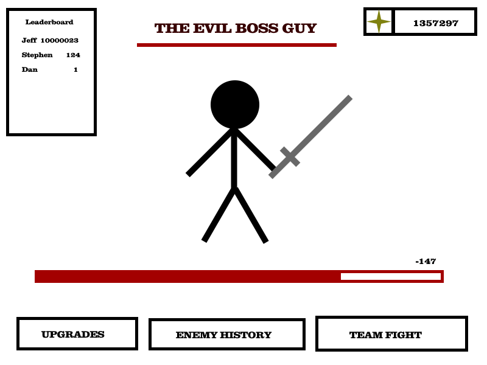
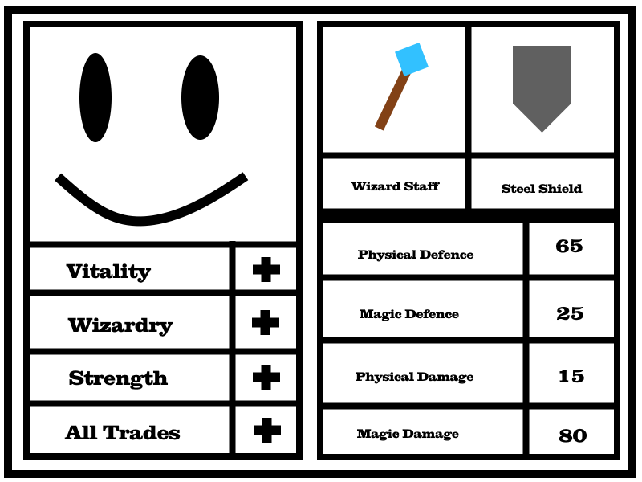
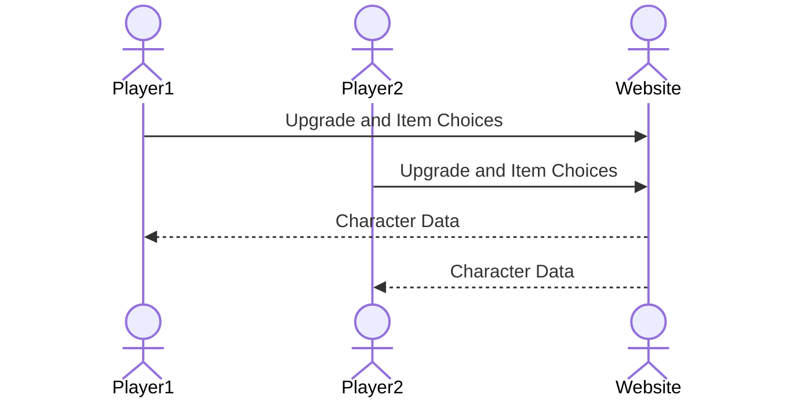

# Second Monitor

[My Notes](notes.md)

A web based idle rpg with multiplayer raid boss style cooperation.

> [!NOTE]
>  This is a template for your startup application. You must modify this `README.md` file for each phase of your development. You only need to fill in the section for each deliverable when that deliverable is submitted in Canvas. Without completing the section for a deliverable, the TA will not know what to look for when grading your submission. Feel free to add additional information to each deliverable description, but make sure you at least have the list of rubric items and a description of what you did for each item.

> [!NOTE]
>  If you are not familiar with Markdown then you should review the [documentation](https://docs.github.com/en/get-started/writing-on-github/getting-started-with-writing-and-formatting-on-github/basic-writing-and-formatting-syntax) before continuing.

## 🚀 Specification Deliverable

> [!NOTE]
>  Fill in this sections as the submission artifact for this deliverable. You can refer to this [example](https://github.com/webprogramming260/startup-example/blob/main/README.md) for inspiration.

For this deliverable I did the following. I checked the box `[x]` and added a description for things I completed.

- [X] Proper use of Markdown
- [X] A concise and compelling elevator pitch
- [X] Description of key features
- [X] Description of how you will use each technology
- [X] One or more rough sketches of your application. Images must be embedded in this file using Markdown image references.

### Elevator pitch

Simple RPGs and Idle games are very popular, having a game you can make progress on in the background or on a second monitor while you work on other things is easier to do for busy people and much lower stress than a lot of games can be. But most such games are totally singleplayer even when it is something a whole friend or work group could be enjoying. The Second Monitor RPG is a simple idle rpg that can be played fully in the browser and with friends, allowing you to assist each other with progress and defeating bosses.

### Design

Gameplay will be handled idly, with defeating enemies earning you items and currency for upgrades. A button to join all active players for a major fight allows cooperative play. 

### Key features

- Idle gameplay perfect for leaving in the background
- Cooperation with other players
- Equipable items
- Upgrades via currency
- Leaderboard to show player progress

### Technologies

I am going to use the required technologies in the following ways.

- **HTML** - Uses correct HTML for application. Provides layout for login, main gameplay, upgrades, and coop play pages.
- **CSS** - Styling for clean ui and effects. Works on multiple screen sizes and formats.
- **React** - Manages the application state for current activity, uses React routing to change views based on player actions, and calls backend to fetch character data and update resources.
- **Service** - Backend service with endpoints for:
  - login
  - updating progression progress
  - joining cooperative sessions
- **DB/Login** - Stores character data. Saves idle progress so players can return later and receive rewards based on time gone. Tracks player leaderboard.
- **WebSocket** - Uses Websocket to provide real-time updates during cooperative play. Broadcasts leaderboard changes to all players.

## 🚀 AWS deliverable

For this deliverable I did the following. I checked the box `[x]` and added a description for things I completed.

- [x] **Server deployed and accessible with custom domain name** - [My server link](https://secondmonitor.click).

## 🚀 HTML deliverable

For this deliverable I set up the structure of my application using HTML. (Dear TAs, please be merciful for me not having spread my commits over the whole deliverable period, I am still figuring out my assigment schedule with my classes)

- [x] **HTML pages** - 5 HTML pages for login, main gameplay, character sheet, leaderboard, and coop boss fights.
- [x] **Proper HTML element usage** - I used HTML tags such as BODY, MAIN, HEADER, NAV, FOOTER, MENU, BUTTON, LI, and ect. 
- [x] **Links** - Set up links between all the pages as well as the login page linking directly to the main play page.
- [x] **Text** - Every page has text for describing the character and enemies, as well as level up choices.
- [x] **3rd party API placeholder** - The enemy and boss names will be generated using name generator API.
- [x] **Images** - Enemies and Bosses will have images, currently marked with placeholders.
- [x] **Login placeholder** - Login based on character name and password will direct you right into the main play page.
- [x] **DB data placeholder** - The character sheet will use the database to store and call character info.
- [x] **WebSocket placeholder** - The leaderboard and coop pages will use Websocket to update information in real-time

## 🚀 CSS deliverable

For this deliverable I styled the application into a state I am happy with.

- [x] **Header, footer, and main content body** - I customed the header, footer, and main body for all the pages, with a consistent header and footer for navigation and redirection to my github.
- [x] **Navigation elements** - Every page has a consistent navigation bar which shows the currently active page.
- [x] **Responsive to window resizing** - I did my best to make all pages work no matter how the window is resized. I struggled with the raid page, it may still have issues on really small windows.
- [x] **Application elements** - Used grids, forms, and columns to arranged application elements in a visually pleasing manner.
- [x] **Application text content** - Organized and placed text to look good as well as utilized two important fonts, Playfair Display and Merryweather, to improve the look of the application.
- [x] **Application images** - I don't yet have images made to be used in the application, but I do have locations for those images to go already blocked out and planned, not sure if that counts.

## 🚀 React part 1: Routing deliverable

For this deliverable I did the following. I checked the box `[x]` and added a description for things I completed.

- [ ] **Bundled using Vite** - I did not complete this part of the deliverable.
- [ ] **Components** - I did not complete this part of the deliverable.
- [ ] **Router** - I did not complete this part of the deliverable.

## 🚀 React part 2: Reactivity deliverable

For this deliverable I did the following. I checked the box `[x]` and added a description for things I completed.

- [ ] **All functionality implemented or mocked out** - I did not complete this part of the deliverable.
- [ ] **Hooks** - I did not complete this part of the deliverable.

## 🚀 Service deliverable

For this deliverable I did the following. I checked the box `[x]` and added a description for things I completed.

- [ ] **Node.js/Express HTTP service** - I did not complete this part of the deliverable.
- [ ] **Static middleware for frontend** - I did not complete this part of the deliverable.
- [ ] **Calls to third party endpoints** - I did not complete this part of the deliverable.
- [ ] **Backend service endpoints** - I did not complete this part of the deliverable.
- [ ] **Frontend calls service endpoints** - I did not complete this part of the deliverable.
- [ ] **Supports registration, login, logout, and restricted endpoint** - I did not complete this part of the deliverable.

## 🚀 DB deliverable

For this deliverable I did the following. I checked the box `[x]` and added a description for things I completed.

- [ ] **Stores data in MongoDB** - I did not complete this part of the deliverable.
- [ ] **Stores credentials in MongoDB** - I did not complete this part of the deliverable.

## 🚀 WebSocket deliverable

For this deliverable I did the following. I checked the box `[x]` and added a description for things I completed.

- [ ] **Backend listens for WebSocket connection** - I did not complete this part of the deliverable.
- [ ] **Frontend makes WebSocket connection** - I did not complete this part of the deliverable.
- [ ] **Data sent over WebSocket connection** - I did not complete this part of the deliverable.
- [ ] **WebSocket data displayed** - I did not complete this part of the deliverable.
- [ ] **Application is fully functional** - I did not complete this part of the deliverable.
